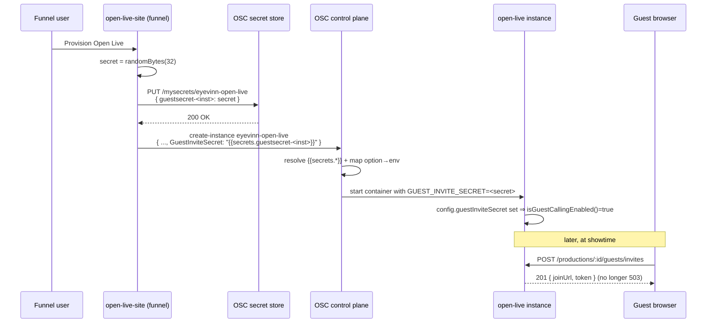

# Spec: Provision `GUEST_INVITE_SECRET` for OSC-deployed Open Live instances

**Status: SUPERSEDED by issue #391** (the OSC-service-option + funnel approach in §2.1/§2.2 was
replaced; see the note below and the per-section "SUPERSEDED" banners). The problem statement
(§1) is still accurate as history.
**Author:** architect agent
**Related issues:** #348 (this defect); #391 (the replacement — backend self-generates and stores
the key); epic #208 and sub-issues #299 (introduced `GUEST_INVITE_SECRET`), #302 (intercom
"degrade cleanly"); #318 / #320, open-live-site#126 / #127 (the same provisioning gap for
`OscAccessToken`)
**Related spec:** `docs/specs/guest-calling-intercom.md` (the guest-calling feature this unblocks)

> **SUPERSEDED (issue #391).** This spec proposed turning guest calling on by provisioning
> `GUEST_INVITE_SECRET` through a new OSC service option (§2.1) plus a funnel change (§2.2).
> @birme objected (osaas-app#6128) that this should be a runtime setting rather than instance-wide
> configuration, and that was accepted. Issue #391 replaces §2.1 and §2.2: the backend now
> **generates its own guest-invite signing key on first start and stores it in its own CouchDB**
> (single fixed-id doc, created only if absent; a concurrent-create conflict re-reads the winner's
> key), reusing it on every restart. `GUEST_INVITE_SECRET` remains an optional override that wins
> when set, so self-hosted setups are unchanged. Guest calling is therefore **on by default** with
> no OSC service option, no funnel change, and no remake of existing instances. The docs change in
> §2.3 still applies (and was folded into #391). See `src/lib/guest-signing-key.ts` and
> `isGuestCallingEnabled()` in `src/config.ts`.
>
> The original text of this spec follows for historical context.
>
> This is a provisioning/config spec, not a feature spec. Guest calling itself is already built
> and accepted (`docs/specs/guest-calling-intercom.md`). The only gap is that no OSC deployment
> path supplies the one required secret, so the feature is dark on every provisioned instance.
> The fix reuses the decided shape of the `OscAccessToken` fix (#318/#320) exactly, so no ADR is
> required (see [§8](#8-adr)).

## 1. Problem Statement

Guest calling is switched off on **every OSC-provisioned Open Live instance**. All guest routes
answer `503`:

- `GET  /api/v1/productions/:id/guests/invites`
- `GET  /api/v1/productions/:id/guests`
- `POST /api/v1/productions/:id/guests/invites`
- plus join / leave / revoke / kick / return-mode

The backend already fails clean and descriptively: `isGuestCallingEnabled()`
(`src/config.ts:285-287`) is `false` whenever `guestInviteSecret` (`src/config.ts:264`, read from
`process.env['GUEST_INVITE_SECRET']`) is unset, and every guest route short-circuits to
`guestsDisabled()` (`src/routes/guests.ts:441-446`), body
`{"error":"Guest calling is disabled — set GUEST_INVITE_SECRET to enable it","statusCode":503}`
(returned at `guests.ts:458,514,540,569,757,809,834`; the return-mode route does the same at
`src/routes/returns.ts:192-194`). This is the intended design (`docs/specs/guest-calling-intercom.md`
§Configuration, `.env.example`, `docs/openapi.yaml`) — a feature gate identical in shape to how
VOD recording gates on its MinIO config (`isRecordingEnabled()`, `config.ts:295-302`).

The gate is correct; the problem is that **nothing sets the secret** on an OSC deployment:

1. The OSC service definition `eyevinn-open-live` has **no option that maps to `GUEST_INVITE_SECRET`**.
   Verified live 2026-09-25 and again for this spec via `get-service-schema eyevinn-open-live`
   (image `v0.4.0` + offset 112): the only `configOptions` are `name`, `DatabaseUrl`, `StromUrl`,
   `StromAuthMode`, `StromAccessToken`, `OscAccessToken`, `CorsOrigin`. So even a user creating the
   instance by hand in OSC cannot turn guest calling on.
2. The funnel (`open-live-site`) does not pass one. `src/server.ts:970-980` builds the create body
   with exactly `name`, `DatabaseUrl`, `StromUrl`, `StromAccessToken`, `StromAuthMode`,
   `CorsOrigin`, `OscAccessToken`. Nothing in `open-live-site` mentions guests.
3. The README env table does not list `GUEST_INVITE_SECRET`, so self-hosters find it only in
   `.env.example`.

Open Intercom is **not** the cause: `INTERCOM_MANAGER_URL` / `INTERCOM_MANAGER_TOKEN` are optional
(`config.ts:273-278`) and join skips the talkback line cleanly when they are unset
(`guests.ts:684`). The single required secret is the whole blocker.

This is the identical failure mode to #318, where `OscAccessToken` had no provisioning path and
every fresh instance returned `503 "Token exchange is not configured"`. That was fixed by
provisioning the value (#320 / open-live-site#127 + a service-schema refresh); this spec applies
the same, already-decided pattern to the guest secret.

## 2. The Provisioning Contract

Three coordinated changes across two out-of-band repos plus one in-repo docs/config change. Only
the last lands in `open-live`; the OSC service definition and the `open-live-site` funnel are
**not board-tracked repos**, so board #47 work is limited to the `open-live` docs + config-fallback
slice. The OSC-schema refresh and the funnel change are companion tasks tracked on their own repos
(mirroring how #320 shipped alongside open-live-site#127).

### 2.1 OSC service definition (`eyevinn-open-live`) — companion, not board-tracked

> **SUPERSEDED by issue #391.** No OSC service option is added. The backend generates and stores
> its own signing key, so guest calling is on by default with no service-schema change. The text
> below is retained for history only.

Add one config option to the `eyevinn-open-live` service definition:

| Option name | Type | Required | Sensitive | Maps to env |
|-------------|------|----------|-----------|-------------|
| `GuestInviteSecret` | string | no | **yes** | `GUEST_INVITE_SECRET` |

- **Optional, not required.** Leaving it optional preserves the backend's clean-degrade contract
  (an instance with no secret is a valid, guest-disabled instance) and does not break the manual
  "create in OSC" path for users who do not want guests.
- **Sensitive.** It is an HMAC signing key. Mark it `sensitive: true` — as `StromAccessToken`
  already is (`sensitive: true` in the live schema). Note: `OscAccessToken` is currently
  `sensitive: false` in the live schema, which is a pre-existing wart on that option and should
  **not** be copied here; the invite secret must be sensitive.

**Env-name mapping — verified, no divergence expected.** The OSC platform maps a PascalCase option
name to a `SCREAMING_SNAKE_CASE` env var at word boundaries: `OscAccessToken` → `OSC_ACCESS_TOKEN`
(which is exactly why `config.ts:99` reads `OSC_PAT ?? OSC_ACCESS_TOKEN`). By that same rule
`GuestInviteSecret` → `GUEST_INVITE_SECRET`, which is precisely the env var `config.ts:264` already
reads. **So in the expected case no `config.ts` change is needed at all** — the mapped name
already matches.

**Fallback contingency (see [§5](#5-configuration)).** If, and only if, empirical verification of
the deployed option shows the platform maps `GuestInviteSecret` to some *other* name (e.g.
`GUESTINVITESECRET` with no separators), add that mapped name as a fallback read in `config.ts`
so a correctly-provisioned instance does not keep 503-ing:

```ts
// config.ts — ONLY if the verified mapped env name differs from GUEST_INVITE_SECRET
guestInviteSecret:
  process.env['GUEST_INVITE_SECRET'] ?? process.env['<verified-mapped-name>'] ?? undefined,
```

This is the exact defensive move `config.ts:99` makes for the token. The verification step
(create a throwaway instance with the new option set, inspect the container env / confirm guest
routes stop 503-ing) is a required part of the companion schema task, not an assumption.

### 2.2 Funnel (`open-live-site`) — companion, not board-tracked

> **SUPERSEDED by issue #391.** No funnel change is needed: the backend self-generates and stores
> the key, so the funnel does not generate, store, or pass a `GuestInviteSecret`. The text below is
> retained for history only.

Mirror the existing `dburl-` / `oltoken-` / `stromtoken-` secret pattern
(`src/server.ts:913-965`):

1. **Generate** a random 32-byte secret per instance (e.g. `crypto.randomBytes(32).toString('hex')`)
   during provisioning. Generated once per instance; never shown to the user.
2. **Store** it as a service secret named `guestsecret-<instanceName>` via
   `PUT ${deployManagerUrl}/mysecrets/${SERVICE_ID}` with
   `{ secretName: "guestsecret-<instanceName>", secretData: <secret> }`, identical to how
   `dburl-`, `oltoken-` and `stromtoken-` are stored (`server.ts:913-965`), with the same
   `!res.ok → throw` error handling.
3. **Pass** it in the create body (`server.ts:970-980`) as one more key:
   `GuestInviteSecret: "{{secrets.guestsecret-<instanceName>}}"`, exactly as
   `OscAccessToken: "{{secrets.oltoken-<instanceName>}}"` is passed today.

The secret is opaque and never surfaced in the funnel UI — the operator gets working guest calling
with zero manual env work, satisfying the issue's Expected ("the same way `OscAccessToken` is now
provisioned").

### 2.3 Docs (`open-live` — **this repo, board-tracked**)

Add the four guest/intercom env vars to the README env table (they exist only in `.env.example`
today):

| Env var | Required | Default | Purpose |
|---------|----------|---------|---------|
| `GUEST_INVITE_SECRET` | to enable guest calling | _(empty)_ | HMAC secret signing guest invite tokens. Unset ⇒ guest routes return 503 |
| `GUEST_INVITE_TTL_S` | no | `86400` | Default guest-invite lifetime (seconds) |
| `INTERCOM_MANAGER_URL` | to enable talkback | _(empty)_ | Base URL of the Open Intercom manager. Unset ⇒ join works, no talkback line |
| `INTERCOM_MANAGER_TOKEN` | to enable talkback | _(empty)_ | Auth token for the Open Intercom manager (server-side only; redacted in logs) |

These four values and their defaults are taken verbatim from `src/config.ts:264-278`.

## 3. Data Model / Migration

**No application data model change.** No CouchDB doc types change; `GUEST_INVITE_SECRET` is an
environment variable, not stored data. Guest invite/session docs are unaffected.

**Migration of existing instances is the one non-trivial part.** The live schema reports
`supportsUpdate: false` for `eyevinn-open-live` (verified via `get-service-schema` for this spec).
That means a **running instance cannot have the new option added in place** — you cannot simply
edit its config to inject `GuestInviteSecret`. Existing beta/customer instances were provisioned
before this change and therefore have no secret.

Decision — migration path for pre-existing instances:

- **New instances** provisioned through the funnel after 2.2 ships get the secret automatically.
  This is the primary, and by far the most common, case (the funnel is the supported entry point).
- **Existing instances** need the secret injected. Because `supportsUpdate: false`, the concrete
  paths are, in order of preference:
  1. **Re-provision / remake** the instance so it is recreated with the new option. On OSC this is
     `admin-remake-service` (or a funnel-driven recreate). This is acceptable for beta instances
     (`beta0925`, `magnus/betatest`) which are disposable test instances.
  2. For a customer instance that must not be recreated, store a `guestsecret-<instance>` secret
     and have OSC ops apply it — but note `supportsUpdate:false` means this is an ops-assisted
     recreate, not a live edit. Flag to the OSC service owner as part of the schema-refresh task.
- **Idempotency:** the funnel `createInstance` call already treats HTTP 409 (already exists) as a
  no-op continue (`server.ts:983-991`). Adding the secret store + create-body key does not change
  that; a re-run stores/overwrites the secret and continues.

There is **no backfill of guest data** to do — before the secret exists no invites could be
created, so there is nothing to migrate beyond the secret itself.

## 4. Sequence Diagram



## 5. Configuration

The exact env vars, sourced from `src/config.ts`:

| Env var | config.ts | Read as | Default |
|---------|-----------|---------|---------|
| `GUEST_INVITE_SECRET` | `:264` | `config.guestInviteSecret` | `undefined` (⇒ guests disabled) |
| `GUEST_INVITE_TTL_S` | `:266` | `config.guestInviteTtlS` | `86400` |
| `INTERCOM_MANAGER_URL` | `:273` | `config.intercomManagerUrl` | `undefined` |
| `INTERCOM_MANAGER_TOKEN` | `:278` | `config.intercomManagerToken` | `undefined` |

Gate: `isGuestCallingEnabled()` (`config.ts:286-287`) returns `Boolean(config.guestInviteSecret)`.

**Optional `config.ts` fallback** (contingent — see [§2.1](#21-osc-service-definition-eyevinn-open-live--companion-not-board-tracked)):
only if the platform's verified option→env mapping for `GuestInviteSecret` is *not*
`GUEST_INVITE_SECRET`, add the verified mapped name as a `??` fallback on `config.ts:264`, exactly
as `config.ts:99` does for `OSC_PAT ?? OSC_ACCESS_TOKEN`. Expected outcome: mapping matches, no
change needed.

## 6. Open Questions (resolved)

1. **Provision the secret, or auto-generate + persist it in CouchDB on first boot?**
   **Resolved: provision it.** This mirrors the decided `OscAccessToken` precedent (#318 decision
   "option 2, provision it", shipped as #320). Auto-generating and persisting an HMAC signing key
   in CouchDB stores the signing key next to the token hashes it protects and moves away from the
   env-configured model the guest-calling spec chose. Provisioning keeps the key out of the
   database and matches every other secret on the instance.

2. **Required or optional service option?** **Resolved: optional.** Preserves the clean-degrade
   contract and does not force guests on manual/self-hosted deployments. The funnel always
   supplies it, so funnel users still get guests out of the box.

3. **Sensitive flag?** **Resolved: `sensitive: true`.** It is a signing key; match `StromAccessToken`
   (not the pre-existing `OscAccessToken: sensitive:false` wart).

4. **Env-name mapping?** **Resolved: expected to match `GUEST_INVITE_SECRET`** by the same
   word-boundary rule that maps `OscAccessToken`→`OSC_ACCESS_TOKEN`; verify empirically and add a
   `config.ts` fallback only if it diverges.

5. **How do existing instances get the secret?** **Resolved: re-provision/remake** given
   `supportsUpdate: false` (see [§3](#3-data-model--migration)); acceptable for the disposable beta
   instances, ops-assisted recreate for any customer instance.

**Genuinely unresolved (human product/ops call):** *secret rotation.* Because
`supportsUpdate: false`, rotating a leaked or compromised `GUEST_INVITE_SECRET` on a live instance
requires a remake, and rotating the secret invalidates all outstanding invite tokens (they are
HMAC-signed with the old key). The team can reasonably default to "rotation = remake; outstanding
invites are short-lived (`GUEST_INVITE_TTL_S`, default 24h) so the blast radius is bounded," but
whether a first-class rotation flow is wanted, and its acceptable operator disruption, is a product
decision for @svensson00. It does **not** block this spec — no rotation path exists today and the
feature is unusable without the base provisioning that this spec delivers.

## 7. Risks and Out-of-Scope

**Out of scope (explicit):**
- **Open Intercom provisioning is NOT required for guest calling.** `INTERCOM_MANAGER_URL` /
  `INTERCOM_MANAGER_TOKEN` are optional and join degrades cleanly without them (`guests.ts:684`,
  matching #302's "with it unconfigured, join still succeeds and `intercomLine` is absent").
  Provisioning an Open Intercom instance from the funnel is a separate future effort.
- **Talkback audio wiring** (live operator↔guest audio) is a marked follow-up
  (open-live-studio PR #152) and is not touched here.
- **Studio "guest calling is disabled" UX** on a 503 is tracked separately as
  open-live-studio#153; this spec makes the 503 stop happening on provisioned instances, which
  is the real fix.

**Risks:**
- **Secret leakage.** The value is an HMAC signing key granting the ability to mint valid invite
  tokens. It must be stored only as an OSC service secret (never in the funnel UI, logs, or the
  create body in plaintext), passed via `{{secrets.guestsecret-<instance>}}`, and it is already
  redacted in `src/lib/log-redact.ts` (per the guest-calling spec §Risks). Marking the option
  `sensitive: true` keeps it out of OSC config readouts.
- **`supportsUpdate: false` migration friction.** Existing instances cannot be updated in place;
  they need a remake to gain guest calling (see [§3](#3-data-model--migration)). Flag to the OSC
  service owner so the schema refresh and any customer-instance remakes are sequenced.
- **Cross-repo coordination.** The three changes (OSC schema, funnel, docs) must all land for the
  end-to-end fix; the schema and funnel repos are not board-tracked, so they are companion tasks
  rather than board items. A funnel that passes `GuestInviteSecret` before the schema option
  exists would have the platform ignore an unknown option — sequence the schema refresh first,
  then the funnel, exactly as #320 sequenced the `OscAccessToken` schema + funnel change.

## 8. ADR

**No ADR required.** This change introduces no new significant design choice: it is a direct
application of the already-decided `OscAccessToken` provisioning pattern (#318 decision → #320),
touches no protocol/transport/encoding, adds no new dependency, and makes no new long-term
trade-off (the provision-vs-persist trade-off was decided in #318). Per `epic-workflow.md`
Phase 1's ADR criteria, none is met. If the team later chooses to build a first-class secret
rotation flow (the one unresolved product call above), that choice may warrant its own ADR then.
